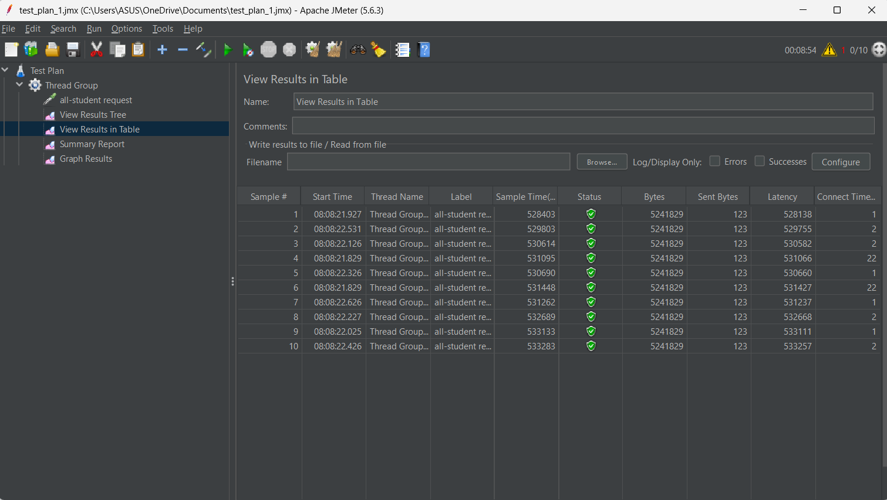
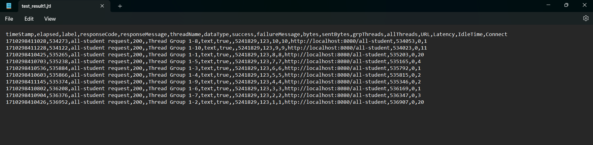
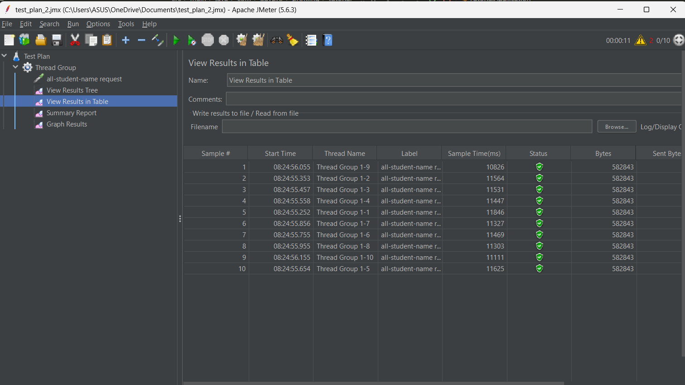
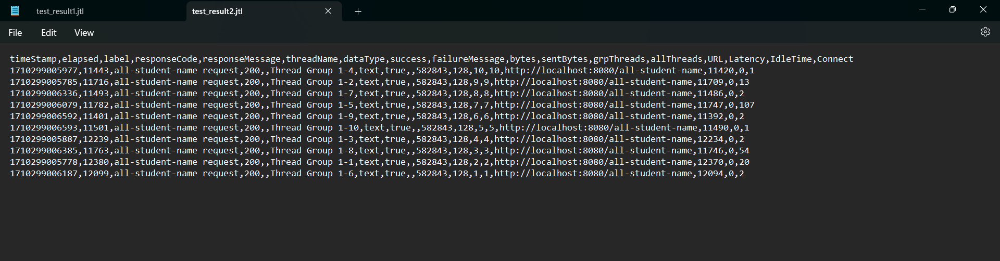
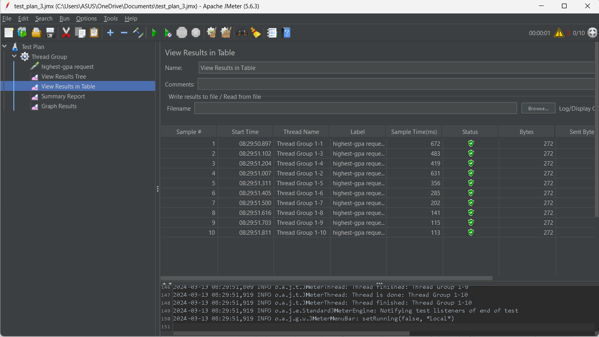
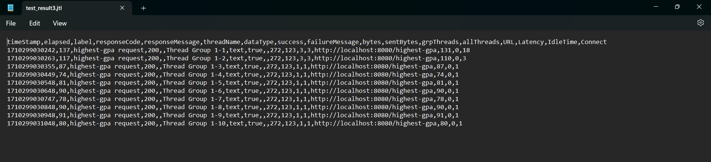

#Refleksi 5
1. Performance testing pada jmeter merujuk pada performa suatu fungsi secara menyeluruh dengan opsi tambahan seperti testing melalui
   jumlah pengguna tertentu dalam waktu bersamaan. Sedangkan profiling dengan intellij profiler menganalisis kinerja performa yang telah
   dilakukan dan mencari tahu proses apa saja yang terjadi dan memberikan data mengenai waktu serta alokasi memori yang dibutuhkan oleh fungsi-fungsi yang
   telah terjadi tersebut. Profiling juga memberi tahu proses apa yang paling menghambat suatu operasi.
   
2. Profiling memberi tahu kita tentang bagian aplikasi apa yang paling berbeban terhadap kinerja seluruh fungsi yang telah dilakukan sehingga
   kita bisa mengidentifikasi titik lemah tersebut. Lalu kita isa memahami seberapa besar alokasi waktu yang digunakan oleh fungsi tersebut
   serta bagian apa yang membutuhkan waktu paling lama sehingga kita bisa mencari tahu apa yang harus diperbaiki dari kelemahan tersebut.
   
3. Intellij memang berguna untuk mengidentifikasi bottleneck pada aplikasi. Namun, pada fungsi tertentu yang bergantung pada modul yang diimpor,
   bottleneck tersebut bisa kita ketahui namun terkadang tidak bisa di optimizasi lebih lanjut.

4. Tantangan utamanya adalah pada testing secara massal melalui jmeter terkadang waktu yang digunakan untuk testing bisa menjadi lama dan
   menghabiskan banyak waktu. untuk menangani masalah tersebut bisa saja saya kurangi jumlah testnya atau membagi test tersebut menjadi
   test yang lebih kecil.

5. Keuntungan utama yang didapat adalah saya dapat mengetahui bagian mana yang perlu dioptimizasi dengan cepat ketika ingin mempercepat
   jalannya fungsi tertentu pada aplikasi saya.

6. Ketika hal tersebut terjadi, saya akan mengulangi kedua test tersebut dan berusaha membandingkan perbedaannya. Bisa saja perbedaan tersebut
   terjadi karena adanya perbedaan jumlah bagian yang dikerjakan atau perbedaan situasi (ketika laptop lagi sibuk atau tidak)

7. Yang akan saya lakukan untuk optimizasi adalah berusaha menggunakan variasi lain dari kode tersebut yang mungkin bisa lebih cepat, menggunakan
   library atau jenis objek tertentu untuk mempercepat proses dibagian tertentu, atau mengubah loop yang digunakan pada suatu fungsi. Untuk memastikan tidak
   ada perubahan fungsionalitas, saya akan mengecek perbedaan hasil setelah dan sebelum optimizasi.

gambar testing:

+++++

+++++

+++++

+++++

+++++

+++++
